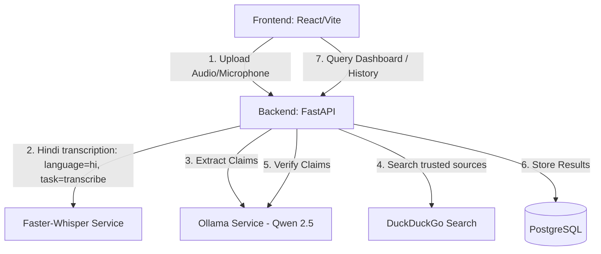

# Spectrum Architecture

This document describes the design principles and architectural patterns utilized in **Spectrum**.

## System Architecture

## Modular Service Layer (SOLID)

To satisfy the request for modularity and scalability, the backend services are divided clearly with dedicated responsibilities:
1. **Audio Service**: Validates files, sizes, and manages physical persistence.
2. **Whisper Service**: Connects to the Faster-Whisper pipeline, manages loading models, and converts audio segments to JSON timelines.
3. **Query Service**: Formats optimized search criteria using LLM prompt files.
4. **Retrieval Service**: Query routing with DuckDuckGo.
5. **Ranking Service**: Slices and filters relevant links to prevent LLM context-window fatigue.
6. **Progress Service**: Determines the status of construction, promise, project, or release as In Progress, Completed, Delayed, etc.
7. **Verification Service**: Performs the final reasoning analysis to yield true/false verdicts.
8. **Dashboard Service**: Handles database aggregates and analytical rates.

## Asynchronous Background Tasks

Large model operations (transcription, claim extraction, web searches, LLM factchecking) are run asynchronously using FastAPI's `BackgroundTasks`. The API uploads the file, returns a processing ID immediately, and runs the complex pipelines in the background. The React frontend uses small client polling to display changes dynamically on the dashboard.
